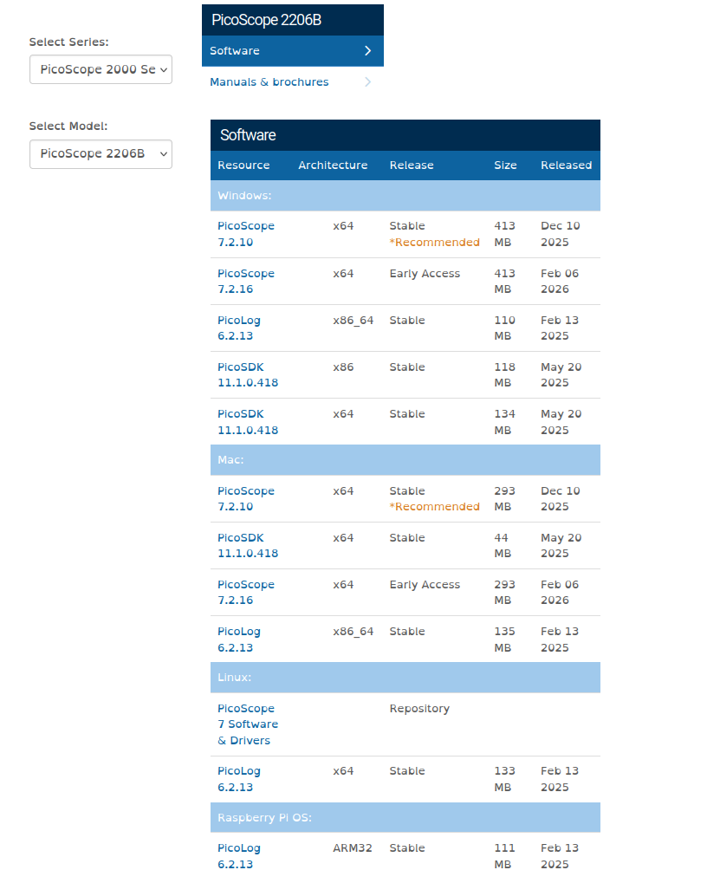

# PicoScope Project Setup Guide

This project provides automated tools to capture and analyze voltage data from a PicoScope 2000 Series oscilloscope. Follow the instructions below to prepare your environment.

---

## 1. Automated Setup (Linux, Windows, Mac)

We have provided a `setup.sh` script to handle dependencies automatically.

### What the script does

1. **Detects your OS** (Linux, Windows, or macOS).
2. **Creates a Python Virtual Environment** (`venv`) to keep your system clean.
3. **Installs Python libraries** (`picosdk`, `numpy`, `pandas`, `matplotlib`).
4. **(Linux Only)** Automatically installs the `picoscope` drivers and software from the official repository.

### How to run it

Open your terminal (or Git Bash on Windows) in `src/picoscope/` and run:

```bash
# Make the script executable (only needed once)
chmod +x pico_setup.sh

# Run the setup
source pico_setup.sh

# Activate the environment
source src/picoscope/venv/bin/activate    # (Linux/Mac)
# OR
source src/picoscope/venv/Scripts/activate # (Git Bash/Windows)

# If you're inside the src/picoscope folder
source venv/bin/activate
# OR
source venv/Scripts/activate
```

## 2. PicoScope GUI Install (Windows, Mac)

If you're on Linux, congrats, the above should have handled everything. If you're on Windows or Mac we're not quite done.

### Downloads

1. Navigate to the [PicoTech Downloads Page](https://www.picotech.com/downloads)
2. For Series, select `PicoScope 2000 Series`
3. For Model, select `PicoScope 2206B`
4. Download the Recommended **Stable** release for your respective OS.



## 3. Test your connection

Plug the picoscope in via USB and then run [pico_example.py](../src/picoscope/pico_example.py)

The picoscope should connect, if you see errors, investigate your packages via pip and make sure everything is up to date.

## 4. Utilize the boilerplate

You are now ready to utillize the [pico_boilerplate.py](../src/picoscope/pico_boilerplate.py)

Feel free to fork this repo, make PRs, raise issues, etc.
